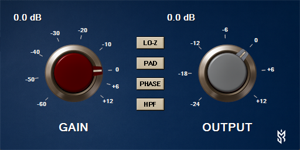

# SR.AnalogGain 🎚️

A simple **gain plugin** built with [NPlug](https://github.com/xoofx/NPlug) demonstrating:

- Basic **audio processing** (linear gain with dB mapping).
- A **custom Win32 UI** featuring analog-style knobs.
- Integration with the **VST3** plugin model (Processor + Controller separation).

---

## ✨ Features

- **Gain Control**: Adjustable from deep attenuation to boost.
- **Output Level**: Independent knob to control final volume.
- **Switches** (analog-style toggles):
  - **LO-Z**: Low-impedance input coloration (pad + HF tilt).
  - **PAD**: Fixed –20 dB attenuation before the gain stage.
  - **PHASE**: Polarity inversion with click-free ramping.
  - **HPF**: High-pass filter around 80 Hz, 18 dB/oct slope.
- **Custom UI**:
  - Dual analog knobs (`GAIN` and `OUTPUT`).
  - Tick marks, dB labels, and animated pointer sprites.
  - Embedded bitmaps for realistic metal-style knobs.
- **Host Integration**:
  - Compatible with VST3 hosts (tested with Windows).
  - Controller + Processor separation following Steinberg’s architecture.

---

## 🎨 Screenshot



---

## ⬇️ Download

Grab the latest release of **SR.AnalogGain** here:

[**Download v0.1.2 (Windows VST3)**](https://github.com/sonicriot/SR.AnalogGain/releases/download/v0.1.2/SR.AnalogGain.vst3)

After downloading, copy the `.vst3` file into your system’s VST3 folder:

- **Windows (64-bit):**
  `C:\Program Files\Common Files\VST3`

---

## 🚀 Getting Started

### Prerequisites

- **Windows** (UI is Win32-specific).
- [.NET 9 SDK](https://dotnet.microsoft.com/download).
- A VST3-compatible host (Cubase, Reaper, Studio One, etc.).

### Build

```sh
git clone https://github.com/sonicriot/SR.AnalogGain.git
cd SR.AnalogGain/src
dotnet publish -c Release -r win-x64 -p:PublishAot=true
```

This will produce a **self-contained, ahead-of-time compiled** `.vst3` plugin in the `SR.AnalogGain/bin/Release/net9.0/win-x64/publish/` folder.

### Install

Copy the built `.vst3` file into your system’s VST3 folder:

- **Windows (64-bit):**  
  `C:\Program Files\Common Files\VST3`

Restart your DAW and scan for new plugins.

---

## 🎛️ Usage

1. Insert **AnalogGain** on an audio track.
2. Adjust the **GAIN** knob to boost or attenuate input signal.
3. Fine-tune with the **OUTPUT** knob to control final level.
4. Use the **switches** (LO-Z, PAD, PHASE, HPF) to shape the input response like on a classic preamp.
5. Observe dB readouts and knob pointer for precision control.

---

## ⚠️ Limitations

- **UI**: Currently implemented in **Win32 (GDI+)**, not cross-platform.  
  On macOS/Linux hosts, only the default generic parameter view will appear.
- **No oversampling / DSP extras**: This plugin is kept minimal for demonstration.

---

## 📜 License

MIT License © 2025  
Feel free to use, modify, and extend.

---

## 🙌 Acknowledgments

- [NPlug](https://github.com/xoofx/NPlug) for the managed VST3 binding.  
- Steinberg VST3 SDK for the plugin architecture.  
- Inspiration from analog gear knob aesthetics.
